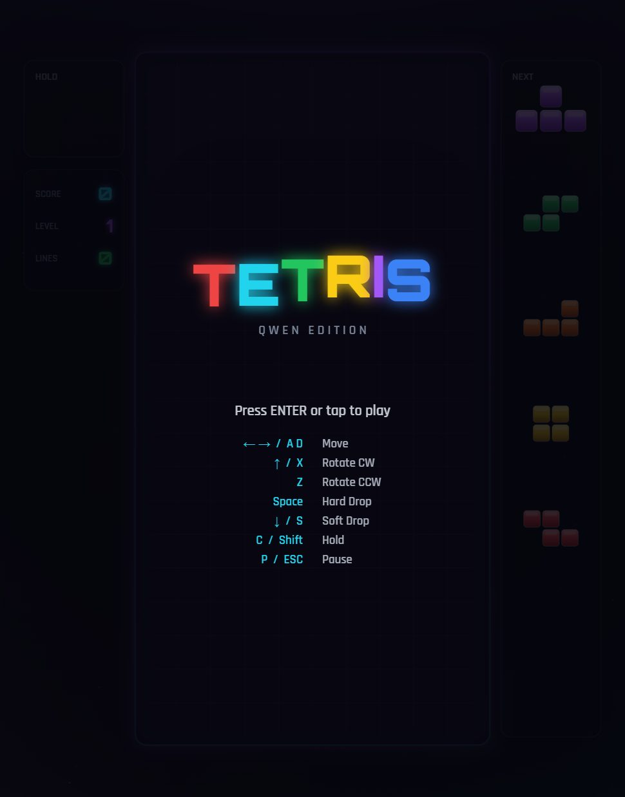

# TETRIS · Qwen Edition

A modern, polished Tetris built with **TypeScript + Vite + HTML5 Canvas**. No game
frameworks, no external assets — everything (graphics, particles, sound) is generated
in code.



## Features

- **Super Rotation System (SRS)** with full wall-kick tables (JLSTZ + I) and 180° kicks
- **T-Spin detection** (full + mini) with the 3-corner rule
- **Ghost piece**, **Hold** (with one-per-drop rule), and a **5-piece next queue**
- **7-bag randomizer** for fair piece distribution
- **Guideline scoring**: singles/doubles/triples/tetris, back-to-back, combos,
  perfect clears, soft/hard drop points
- **Lock delay** with move-resets (capped), gravity curve per level
- **Competitive input feel**: DAS + ARR auto-shift, soft-drop repeat, hard drop
- **Juicy visuals**: neon beveled blocks, particle bursts, row-shatter clears,
  screen shake, flash, floating combo/level text, animated starfield
- **Procedural audio** via Web Audio API (SFX + looping arpeggio music)
- **Responsive** canvas layout + **touch/swipe controls** for mobile
- Pause, level-up banners, game-over screen, and a start menu

## Controls

| Action | Keys |
| --- | --- |
| Move | `←` `→` or `A` `D` |
| Rotate CW | `↑` or `X` |
| Rotate CCW | `Z` |
| Rotate 180° | `R` |
| Soft drop | `↓` or `S` |
| Hard drop | `Space` |
| Hold | `C` or `Shift` |
| Pause | `P` or `Esc` |
| Start / Restart | `Enter` |

**Touch:** tap to rotate, drag horizontally to move, drag down to soft-drop,
swipe up to hard-drop.

## Getting started

```bash
npm install
npm run dev      # start dev server at http://localhost:3000
npm run build    # type-check + production build to dist/
npm run preview  # preview the production build
npm run typecheck
```

## Project structure

```
src/
  main.ts            # game loop, wiring, touch controls
  style.css          # page background + canvas styling
  game/
    types.ts         # core types (discriminated unions for state)
    constants.ts     # tetromino shapes, SRS kicks, colors, scoring
    board.ts         # collision, line clears, 7-bag
    engine.ts        # game state machine + rules
    input.ts         # DAS/ARR keyboard handling
    renderer.ts      # canvas rendering + effects
    particles.ts     # particle + floating-text system
    audio.ts         # Web Audio synthesized sound
test/
  engine.test.ts     # headless engine tests (node --experimental-strip-types)
```

## Tests

```bash
node --experimental-strip-types test/engine.test.ts
```

## License

MIT
